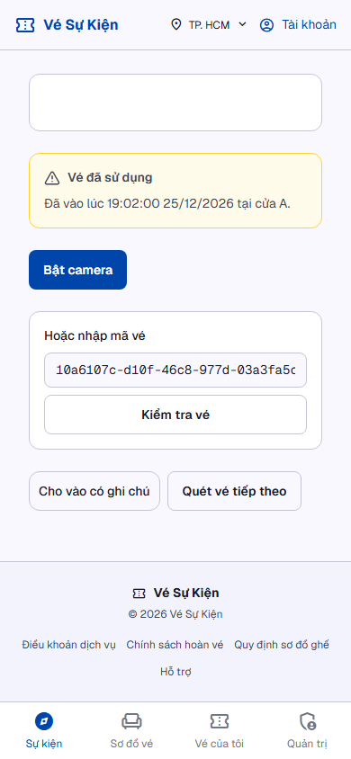
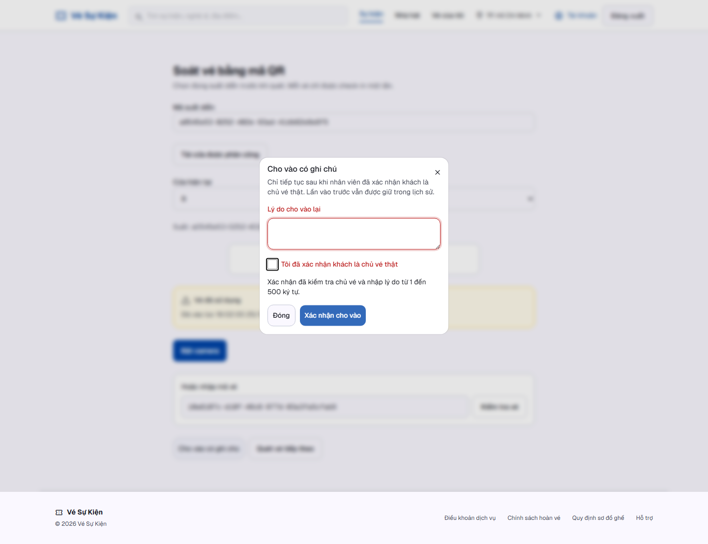

# S-31 — Bằng chứng kiểm chứng

**PASS local cho ba hành vi AC trên contract UUID hiện tại của S-30; nghiệm thu toàn bộ vẫn BLOCKED vì dependency chưa merge và chưa có signed QR verifier.** Camera thiết bị thật/staging chưa kiểm. Không ghi Done.

API tested SHA: `285c9afe5b56483118b2b655750e9ab2ae8ccd9e`. Browser tested SHA: `59314d16710a38152c1b23e98aef289aea792bb8`; driver SHA256 được lưu riêng trong browser-proof.json. Report JSON lưu sourceSha, thời gian và kết quả thật. Commit chứa evidence/documentation sau đó không thay logic đã kiểm; exact final head/CI/review được cập nhật ở PR #64. Không dùng candidate storage proof làm acceptance.

## Ma trận AC/NFR → implementation → test → kết quả → evidence → SHA

| AC/NFR                                         | Implementation                                             | Test thực                                                                                          | Kết quả local                              | File/link                                                                                                                            | SHA     |
| ---------------------------------------------- | ---------------------------------------------------------- | -------------------------------------------------------------------------------------------------- | ------------------------------------------ | ------------------------------------------------------------------------------------------------------------------------------------ | ------- |
| AC1: vào A 19:02, scan B từ chối, metadata đầu | service lock/read NORMAL, 409 firstAdmission; scanner USED | HTTP first response/time DB, history fixture 19:02 Việt Nam, scan session B; browser               | PASS                                       | [HTTP JSON](../evidence/s31/http-proof.json), [desktop](../evidence/s31/desktop-used.png), [mobile](../evidence/s31/mobile-used.png) | 285c9af |
| AC2: một máy hợp lệ                            | FOR UPDATE oi/o + partial unique NORMAL                    | 50 vé mới ×2 HTTP request, hai tiến trình Nest/sessions/cửa; đọc ledger/state từng vé              | PASS                                       | [HTTP JSON](../evidence/s31/http-proof.json), verify-s31-http.mjs                                                                    | 285c9af |
| AC3: ngoại lệ có reason/name                   | capability theo Gate, endpoint riêng, DB snapshot          | 2 request cùng action qua hai API; đúng1 EXCEPTION, first giữ nguyên; dialog thực                  | PASS local, PO đã chốt                     | [decision](S31_PERMISSION_DECISION.md), [exception](../evidence/s31/desktop-exception.png), HTTP JSON                                | 285c9af |
| Atomic DB, restart, rollback                   | constraint + transaction                                   | restart API, direct duplicate insert, trigger lỗi sau insert trước cập nhật checkedInAt            | PASS                                       | HTTP JSON, migration SQL                                                                                                             | 285c9af |
| Scan/exception retry                           | unique actor/request, canonical fingerprint                | scan và exception double submit → SUCCESS/RECORDED; changed reason409; UUID case retry             | PASS                                       | HTTP JSON; browser JSON                                                                                                              | 285c9af |
| Session/quyền/metadata tối thiểu               | guard, TX session + grant check trước vé                   | no-session, expired, BUYER, STAFF sai cửa, ADMIN unassigned, quyền ngoại lệ bị thu hồi             | PASS                                       | HTTP JSON                                                                                                                            | 285c9af |
| Vé không đủ điều kiện                          | order PAID, seat/showtime checks                           | malformed/unknown/unpaid/cancelled/wrong showtime; exception không bypass                          | PASS cho contract hiện tại                 | HTTP JSON                                                                                                                            | 285c9af |
| Chữ ký QR                                      | S-30 chỉ UUID, không verifier                              | Không có protocol/key/vé ký để kiểm                                                                | CHƯA KIỂM / BLOCKER                        | [S-30 #68](https://github.com/TTCS-T926-K19C5-N2/thudemo/pull/68)                                                                    | 3dc6b5c |
| Lý do/giả danh                                 | command validator + actor từ session                       | whitespace,501 ký tự, no attestation, forged staff/time, quyền sai                                 | PASS                                       | contract specs + HTTP JSON                                                                                                           | 285c9af |
| Sau ngoại lệ vẫn used                          | first NORMAL không reset                                   | quét thường409, metadata19:02A, 1NORMAL+1EXCEPTION                                                 | PASS                                       | HTTP JSON                                                                                                                            | 285c9af |
| Legacy S-30                                    | giữ checkedInAt, không tạo lịch sử giả                     | used thiếu ledger →409/không override, cửa chưa biết                                               | PASS, hạn chế được nêu rõ                  | HTTP JSON                                                                                                                            | 285c9af |
| Migration/rollback giữ lịch sử                 | additive migration; compensation guard                     | 21 migration deploy thật; guard từ chối populated DB                                               | PASS deploy/guard; rollback rỗng chưa chạy | HTTP JSON + template                                                                                                                 | 285c9af |
| V1/browser/a11y/timeout                        | scanner S-30 + Dialog/Field/Button, live region            | desktop1440×1000/mobile390×844, focus/trap/Escape, validation, >3s, lỗi mạng/retry, touch/contrast | PASS, 26 checks                            | [browser JSON](../evidence/s31/browser-proof.json), screenshots bên dưới                                                             | 59314d1 |
| Camera thật                                    | html5-qrcode S-30 giữ nguyên                               | Chỉ nhập mã vé thật từ fixture trong browser; không quay camera thiết bị                           | CHƯA KIỂM                                  | browser JSON camera=false                                                                                                            | —       |
| Staging/production                             | Không deploy                                               | Không chạy                                                                                         | CHƯA KIỂM                                  | —                                                                                                                                    | —       |

## Môi trường và tái chạy

Node24.21.0/pnpm10.15.1; PostgreSQL15/Redis7, riêng container S-31, DB s31_admission_integration ở 127.0.0.1:15438, Redis16386. Không reset/touch database đang chạy của task khác. 21 migration từ repo được deploy thật. Hai API OS process3041/3042 (restart thêm process3041) và hai phiên cookie staff thật từ DB. Fixture session chỉ lưu ngoài repository, không log/commit cookie.

- `pnpm --filter api exec prisma migrate deploy`, generate, build trên DB riêng nêu trên.
- `node apps/api/scripts/verify-s31-http.mjs`: 29 checks + 50 races PASS; 134 HTTP measurements, p95≈27.98ms/max≈79.15ms loopback local. Đây không là staging/NFR tải T-31 hoặc benchmark thiết bị.
- `pnpm --filter api exec vitest run --config ./vitest.config.e2e.ts test/ticket-check-in.e2e-spec.ts`: 4 S-30 regression PASS, thực DB S-31 riêng. Thêm gate/grant fixture và cleanup ledger, không hạ assertion.
- Format, lint, typecheck, build PASS; unit API151 + web43 =194 PASS. Có 4 lint warning cũ ở payment/mock test, không thuộc S-31. Full integration của repo chờ/đối chiếu CI exact final SHA; không chạy suite đó vào DB15432 đang thuộc task khác.
- Browser plugin không có trong session; fallback Playwright bundled1.62.1 Chromium. Chạy Web production build localhost3040, API riêng localhost3001 dùng DB S-31. Proxy same-origin thật, hai cookie contexts độc lập. Delay/abort response là fault injection có nhãn; response nghiệp vụ thực từ API, không mock admission.
- Fixture lịch sử 19:02 được ghi trực tiếp nhất quán ở database kiểm thử SAU khi đã kiểm first response bằng thời gian DB hiện tại; không giả thời gian client/máy chủ hoặc thay test concurrency bằng mock. Điều này kiểm text/metadata ví dụ AC1.
- Hướng dẫn browser: sinh fixture vào path private ngoài Git bằng S31_PRIVATE_FIXTURE_FILE khi chạy HTTP harness; đặt S31_PLAYWRIGHT_MODULE tới Playwright có sẵn và chạy verifier browser. Không commit fixture cookie. Xem script để đọc exact assertions.
- Candidate `storage-proof.json` cũ vẫn là nghiên cứu schema fixture khác, không gộp vào 29 product checks.

## Visual QA

PublicLayout, font/tokens V1 và scanner S-30 được giữ; không đổi CSS toàn dự án. Thêm gate/context và cảnh báo/dialog đúng chức năng. Dialog dùng shadcn Radix đã tra [docs](https://ui.shadcn.com/docs/components/radix/dialog), title/description/focus trap; React review bằng skill khả dụng. Lỗi kết quả cũ khi sửa ô mã vé đã được sửa và kiểm trên browser; kết quả hợp lệ/đã dùng bị xóa ngay khi mã thay đổi. Có kiểm mất phản hồi SAU commit, giữ cùng key cho scan/exception và hiển thị replay riêng.

Skills vercel:nextjs/agent-browser-verify được AGENTS nhắc nhưng không có trong catalog; dùng skill frontend-testing-debugging/React thực sự khả dụng, không đoán plugin hoặc đổi stack.

Các ảnh được đọc trực tiếp để đối chiếu header, nền, font và controls V1; reset scroll khi chụp mobile để tránh ảnh fullpage làm sticky header xuất hiện giữa trang. Chỉ button scanner/dialog có minimum touch height44px; không đổi primitive dùng chung cũ.

## Gate nghiệm thu còn lại

S-30 #68 chưa merge/review đầy đủ; unsigned UUID có thể bị dùng lại như mã thật nếu biết ID. Chưa thể chứng minh QR sai chữ ký bị chặn. Cần contract signed QR/S-26 được duyệt để tích hợp verifier S-30 rồi re-run S-31, không tự xây hệ QR thứ hai. Giữ Draft/Changes requested dù local AC và CI xanh. Camera thật và staging chưa PASS. Không merge/deploy/đóng issue.
