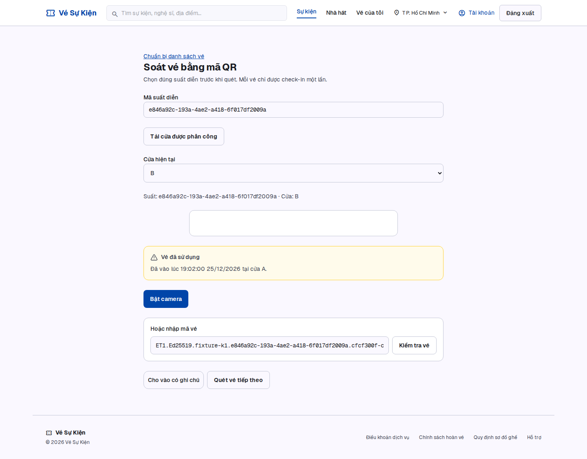
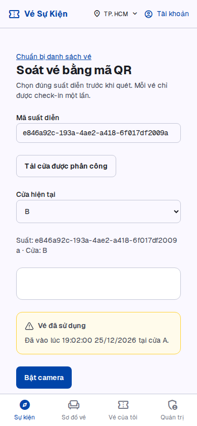
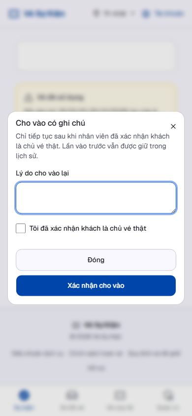
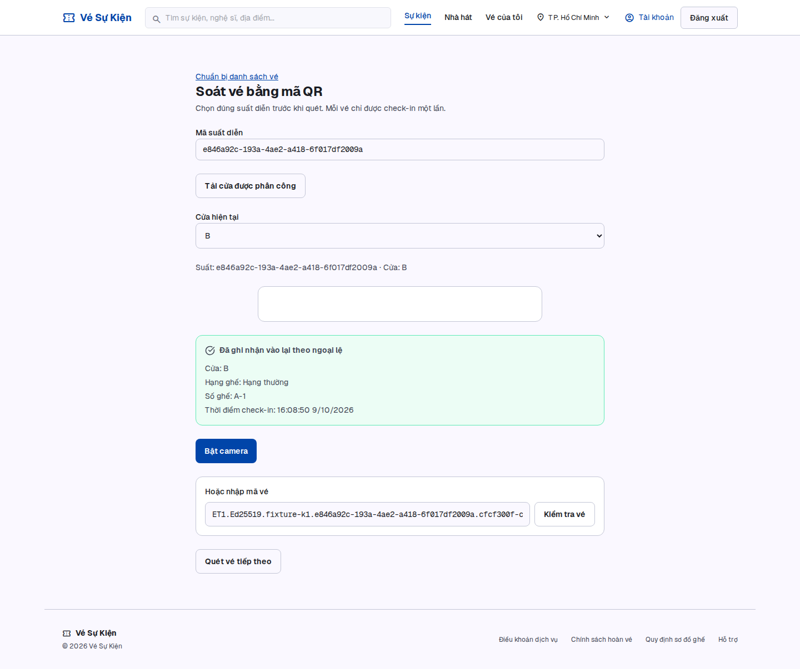

# S-31 — Bằng chứng QR ký, cập nhật 10/10/2026

Dependency S-30 đã merge vào main qua PR #68 ngày 10/10, merge SHA `2498c52901d8a2dfc7b25bdbd4d76035f1fc3bdf`, reviewed head `75d15ec` bằng tài khoản Sáng. [Bằng chứng hai Android thật và báo cáo dưới nắng](S30_DEVICE_EVIDENCE_20261010.md) nằm trong repository. S-31 đã merge main bằng commit `5a97a91c6e06efa4249d96e8bb99baaca4e8ed51`, PR #64 base main; không xóa snapshot hoặc viết lại lịch sử. Giữ Draft đến kiểm điện thoại S-31 và review cuối; chưa merge/deploy S-31.

## Nghiệm thu lại bản tích hợp main

CI [38055675913](https://github.com/TTCS-T926-K19C5-N2/thudemo/actions/runs/38055675913) completed SUCCESS trên **5a97a91c6e06efa4249d96e8bb99baaca4e8ed51**. Artifact mới được tải nguyên bytes vào [ci-5a97a91](../evidence/s31/ci-5a97a91), không thay source SHA của kết quả cũ.

| AC/NFR                                            | Implementation                                                                                                  | Test / kết quả                                                                                  | File/link                                                                                                              | Source SHA |
| ------------------------------------------------- | --------------------------------------------------------------------------------------------------------------- | ----------------------------------------------------------------------------------------------- | ---------------------------------------------------------------------------------------------------------------------- | ---------- |
| AC1: lần đầu A 19:02, quét B từ chối/time/cửa đầu | Signed verifier + locked first NORMAL                                                                           | PASS HTTP/browser/DB, giữ lần đầu                                                               | [HTTP](../evidence/s31/ci-5a97a91/http-proof.json), [browser](../evidence/s31/ci-5a97a91/browser-proof.json)           | 5a97a91    |
| AC2/NFR nguyên tử                                 | PostgreSQL row locks + partial UNIQUE NORMAL + transaction                                                      | PASS 50 vé mới × hai OS API process/session/cửa; trực tiếp đếm database                         | HTTP proof                                                                                                             | 5a97a91    |
| AC3 ngoại lệ                                      | Explicit capability theo staff/suất/cửa, default false; same QR verifier; reason/attestation; trusted name/time | PASS 1 EXCEPTION khi retry đồng thời, giữ NORMAL; revoke/sai quyền/sai QR/giả danh/blank denied | HTTP proof, PO decision, [dialog](../evidence/s31/ci-5a97a91/mobile-dialog.png)                                        | 5a97a91    |
| Retry/lost response/restart/rollback              | Unique staff/request fingerprint, ledger/state same TX                                                          | PASS HTTP/browser; rollback trigger không để state/history dở dang; normal sau exception denied | HTTP/browser proof                                                                                                     | 5a97a91    |
| V1/S-30 hồi quy                                   | Same signed scanner; existing Dialog; >3s waiting/no network green                                              | PASS 27 browser checks, no unexpected runtime/console errors, focus/mobile/contrast/touch       | [desktop](../evidence/s31/ci-5a97a91/desktop-exception.png), [mobile used](../evidence/s31/ci-5a97a91/mobile-used.png) | 5a97a91    |
| Camera/ngoại lệ trên điện thoại bản S-31 mới      | S-30 camera + S-31 dialog                                                                                       | CHƯA KIỂM phiên S-31; không mượn camera S-30 để khẳng định dialog ngoại lệ thật                 | Cần phiên local riêng 3060/3061/15442/16392                                                                            | pending    |

Tổng mới: **46 HTTP checks, 50 races, 27 browser checks**. CI [S-30 compatibility](https://github.com/TTCS-T926-K19C5-N2/thudemo/actions/runs/38055675918) PASS; [T-02/K-01/T-31](https://github.com/TTCS-T926-K19C5-N2/thudemo/actions/runs/38055675929) PASS. S-43 vẫn chạy tại lần ghi; trạng thái cuối phải kiểm ở PR. Local format/lint/typecheck và 228 unit tests đã chạy lại PASS trên 5a97a91, bốn warning baseline. Build/migration/integration HTTP/browser mới chạy thật trong CI; không gọi đó là local. Hai camera S-30 kiểm tuần tự bằng một USB; bằng chứng race ở đây là hai API process thật, không giả hai camera đồng thời.

Không migration mới khi tích hợp: ledger 202610080003 đã có trên main và byte-identical; constraint/idempotency/permission không bị bỏ. App rollback về S-30 ký giữ ledger. Empty destructive compensation và staging chưa chạy, không báo PASS. Dữ liệu test riêng, không reset DB hoặc sửa applied migration.

## Bằng chứng revision trước, giữ nguồn gốc

CI [37909249448](https://github.com/TTCS-T926-K19C5-N2/thudemo/actions/runs/37909249448) PASS trên **8e6374d45574ab06ed08e1d81619aa0030401526**:46 HTTP checks/50 races/27 browser checks. JSON và ảnh mới bên dưới cùng sourceSha này; commit bàn giao chỉ cập nhật evidence/docs, final-head CI/review được ghi ở PR64.

## Ma trận AC/NFR → implementation → test → kết quả → file/link → SHA

| AC/NFR                                    | Implementation                         | Test mới                                                                                     | Kết quả                                     | File/link                                                         | Source SHA             |
| ----------------------------------------- | -------------------------------------- | -------------------------------------------------------------------------------------------- | ------------------------------------------- | ----------------------------------------------------------------- | ---------------------- |
| AC1: A19:02 → B từ chối/metadata đầu      | lock NORMAL/firstAdmission             | real HTTP/session B, DB first/time check rồi fixture lịch sử                                 | PASS local                                  | verify-s31-http.mjs, [HTTP JSON](../evidence/s31/http-proof.json) | 8e6374d                |
| AC2: chỉ một máy hợp lệ                   | row lock + partial UNIQUE              | 50 vé mới ×2 API OS process/session/cửa, đọc DB mỗi lượt                                     | PASS local                                  | HTTP driver/report                                                | 8e6374d                |
| AC3: reason/tên nhân viên/lần vào bổ sung | approved scoped capability + EXCEPTION | same action concurrent2API, đúng1entry, identity/name/timeDB; first không đổi                | PASS local                                  | HTTP driver, PO decision                                          | 8e6374d                |
| Chữ ký NORMAL/EXCEPTION                   | cùng ScannerCryptoService              | unsigned real UUID, version/alg/kid/signature/payload sai; ticketId client; wrong showtime   | PASS local, không thêm history              | HTTP driver; S-30 crypto unit13                                   | 8e6374d                |
| Rotation/restart                          | persistent keys + public key ring      | new k2 QR NORMAL+EXCEPTION; old k1 vẫn verified/used sau restart                             | PASS local                                  | HTTP driver                                                       | 8e6374d                |
| Retry/bấm đúp/lost response               | unique actor/request fingerprint       | same request concurrent; changed reason409; browser fault injection                          | PASS local HTTP / CI HTTP+browser           | drivers                                                           | 8e6374d; final CI ở PR |
| Rollback/consistency                      | ledger+state cùng TX                   | trigger failure sau insert; ledger0/stateNULL; direct duplicate rejected                     | PASS local                                  | HTTP driver/ledger migration                                      | 8e6374d                |
| Permission/privacy                        | role+session+grant trước metadata      | unassigned ADMIN, wrong gate, BUYER, no/expired session, revoked override, forged actor/time | PASS local                                  | HTTP driver                                                       | 8e6374d                |
| Eligibility/sau ngoại lệ                  | PAID + signed context + legacy veto    | unpaid/cancelled/unknown/wrong showtime; normal sau EXCEPTION vẫn409/first giữ nguyên        | PASS local                                  | HTTP driver                                                       | 8e6374d                |
| Migration/compensation                    | 22migration thật/guard                 | deploy riêng, populated guard refuses                                                        | PASS deploy/guard; empty rollback chưa kiểm | SQL template/HTTP driver                                          | 8e6374d                |
| V1 desktop/mobile/dialog/wait/error       | scanner dependency + existing Dialog   | browser real proxy/API/PG, 2staff contexts, focus/trap/contrast/touch, lost response retry   | PASS CI27 checks, console/runtime0          | verify-s31-browser.mjs / s31-admission.yml                        | 8e6374d; final CI ở PR |
| Camera vật lý / ngoài trời                | camera hiện hữu                        | chưa có người kiểm trên signed revision                                                      | CHƯA KIỂM — gate                            | hướng dẫn dưới                                                    | —                      |
| Staging/deploy                            | không deploy                           | chưa chạy                                                                                    | CHƯA KIỂM                                   | —                                                                 | —                      |

Local candidate: DB riêng `127.0.0.1:15442/s31_signed_qr`, Redis16392; API3061/3062;22 migration deploy thật. 46 checks/50 races/151 measurements, p95≈34.11ms/max≈52.12ms loopback. Không thay staging/4G/camera hay NFR T-31. Node24.21.0/pnpm10.15.1. Build/lint/typecheck/unit228 PASS;4 warning cũ. Full integration84 tests PASS trên DB regression riêng15432 do task này tạo, không dùng DB của task khác.

Private keys/cookie fixtures ngoài checkout; artifact chỉ sanitized JSON/PNG. JSON/ảnh hiện tại đã thay bằng artifact ký thật8e6374d, giữ raw bytes/sourceSha. Evidence UUID59314d1 vẫn truy cập qua lịch sử Git, không dùng nghiệm thu mới. Candidate storage research vẫn tách biệt. HTTP report mới chứa sourceSha/driver hash; [HTTP JSON](../evidence/s31/http-proof.json) đặt tên theo headSHA, không gọi working-tree report là exact committed test.

## Tái chạy và kiểm thiết bị

Migrate/generate/build trên đúng DB/Redis test riêng. Chạy HTTP driver với S31_FIXTURE_KEY_DIR và S31_PRIVATE_FIXTURE_FILE ngoài Git. CI dựng2API thật rồi web3060 proxy3061; driver browser dùng fixture phiên đã tạo, delay/abort chỉ là fault injection trên response thật.

Camera gate: dùng thiết bị thật trên secure context với session được cấp suất/cửa. Mở QR ký của vé PAID thật qua trang đơn chủ vé; quay camera quét, kiểm ghế/cửa/time sau commit, đổi cửa quét lại metadata đầu, invalid/unsigned bị từ chối, mất mạng không xanh, >3s chờ. Thử dưới ánh sáng ngoài trời đọc text/icon và thao tác. Ghi thiết bị/OS/browser, SHA, điều kiện ánh sáng, kết quả/ảnh không cookie/QR khách. Ảnh/video fixture, mobile viewport hoặc camera giả không thay bằng chứng này.

## Browser / audit

Đã đọc ảnh desktop/mobile để đối chiếu V1. Warning contrast14.46:1, touch≥44px, focus/trap/Escape/live region, không runtime/console error bất thường. Image/typed signed fixture không thay camera thật.

Run [37908667173](https://github.com/TTCS-T926-K19C5-N2/thudemo/actions/runs/37908667173) trên5cd1e2d: HTTP PASS nhưng browser FAIL vì driver nhầm retry cùng request thành lượt quét mới. Source và ảnh cho thấy ALREADY_RECORDED đúng. Commit8e6374d sửa giả định, giữ assertion replay và thêm assertion bấm Next tạo lượt mới phải USED; run37909249448 PASS. Không hạ assertion/tắt test.
