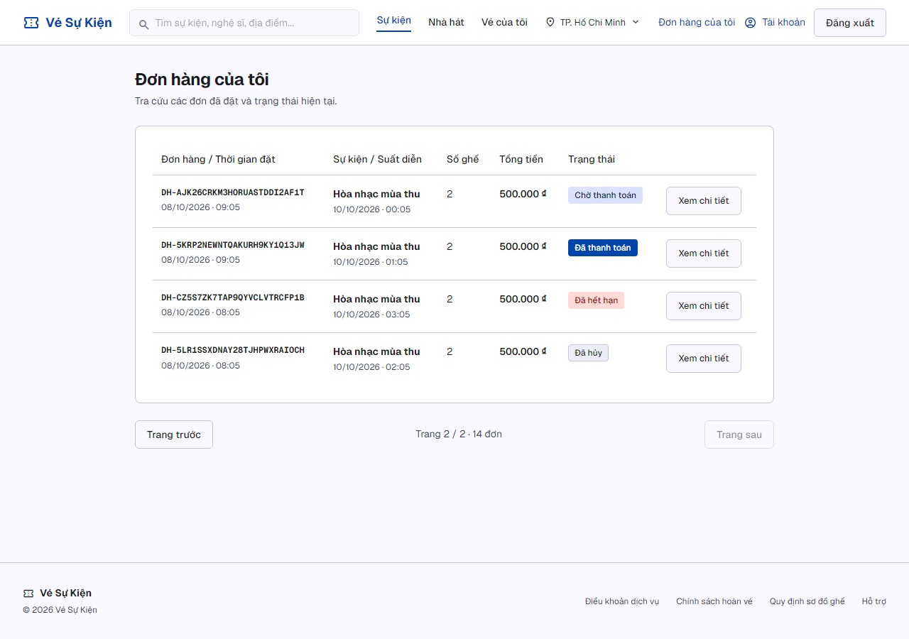
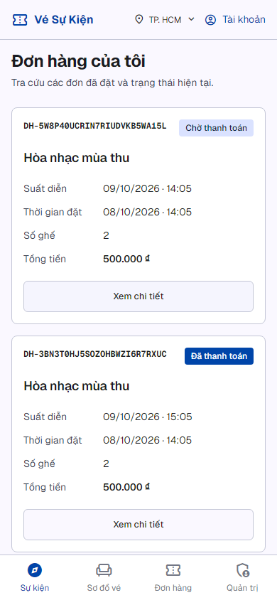

# S-32 — evidence trên base main ngày08/10/2026

**Local verified trước commit**, branch `task/orders-integration-ready`, base `de610b58ab065a22342ab18a49970626134197fd`. Báo cáo này là snapshot kiểm thử local; trạng thái Git/CI tiếp theo được ghi trong PR. Chưa tích hợp main hoặc staging. Phạm vi và gate: [ORDERS_INTEGRATION_HANDOFF.md](ORDERS_INTEGRATION_HANDOFF.md).

## Môi trường thật, tách riêng

- PostgreSQL15 container `thudemo-orders-priority-postgres-20261008`,127.0.0.1:15434,db `sprint2_integration` mới; Redis7 container `thudemo-orders-priority-redis-20261008`,127.0.0.1:16381.
- API http://localhost:3301,web http://localhost:3300; `.env` ignored chỉ credentials/key synthetic local. Không sửa các container15432/16379 hoặc database dùng tại checkout trước.
- `S32_ISOLATED_TEST=true`,HOLD_EXPIRY_MODE=off,ORDER_EXPIRY_MODE=off; PAYMENT_GATEWAY=mock cho browser. Suite gateway baseline dùng adapter momo **với HTTP provider mocked**; không gọi sandbox thật. Full integration process WEB_ORIGIN localhost3000 theo các auth test hiện có.
- 18 migrations deploy bằng Prisma, không reset/db push; frozen lockfile, không cài/nâng dependency. Playwright Chromium từ bundled runtime đã có; không có Browser plugin/browser skill hoặc các skill cũ `vercel:nextjs`/`vercel:agent-browser-verify`, dùng executable E2E theo yêu cầu ban đầu.
- Fixture A14/B3/empty/admin/organizer, hai ghế/đơn, tied timestamps, PENDING_PAYMENT/PENDING/PAID/CANCELLED/EXPIRED/NEEDS_REVIEW; có pending quá hạn chưa cleanup. Fixtures cố ý có timestamps/deadline synthetic để kiểm các nhánh; bằng chứng hạn10phút lấy từ **đơn tạo thật qua hold API**, không suy từ fixture viết DB trực tiếp.
- Guard15434 chỉ được thêm khi cờ isolated true; giữ guard15432 cũ và dbname/loopback checks. Cleanup chỉ phục vụ disposable isolated test workflow; không xóa lịch sử người dùng để làm sạch UI. Browser fixture giữ để preview.

## Traceability

| AC/NFR hoặc dependency                          | Implementation                                                            | Test/proof                                                                                            |
| ----------------------------------------------- | ------------------------------------------------------------------------- | ----------------------------------------------------------------------------------------------------- |
| AC1: mới nhất trước, đầy đủ field và pagination | owner-scoped read,createdAt/id DESC,take/skip; desktop table/mobile cards | A10+4/B3,tied timestamps repeated stable;page/detail/back/reload/direct URL;API+browser               |
| AC2: mã đơn người khác403                       | owner probe trước content,scoped query;detail/status shared guard         | A→B và B→A real cookie/API403/body không nội dung;browser cross-account/direct forbidden;admin/unauth |
| AC3: cancelled/expired vẫn xuất hiện            | không status filter,shared expiry helper,readonly projection              | persisted/inferred EXPIRED khi worker off,CANCELLED detail;legacyPENDING expiry vàNEEDS_REVIEW        |
| NFR: server pagination/no full fetch/N+1        | order query LIMIT/OFFSET,_count,batched relations                         | size1/10/50 trả1/10/14,6SQL/request cố định,SQL placeholder không params;không write                  |
| S16/DEC10                                       | locked creator chung,order expiry=hold original,bỏ extension writes       | 35S15/S16 cases: exact deadline,repeat/add/concurrency/rollback/price snapshots                       |
| S17/S22 compatibility                           | flat+nested detail,light status/latestPayment,one V1 surface              | 7Orders cases gồmstatus/detail latestPayment vàS23expiry;24S32cases gồmshape/recordedtotal            |
| Price change không đổi lịch sử/payment          | recorded order total và unitPrice                                         | category900k order500k;hold-created320k/live999999 → pay/callbackPAID320k,deadline không đổi          |
| GET không mutation                              | dedicated read service                                                    | snapshot order/holds/deadlines trước/sau allGET vàallbrowserflows giống nhau                          |
| Cache/session                                   | no-store/private,abort/revalidate,cross-tab,logout document navigation    | expired-session exactreturn;logout/browserback/A→B/cross-tab,no old orders                            |

Raw reports: `evidence/orders-integration/20261008/`. SQL6statement proof là chống N+1/materialization tại application, **không là load/performance benchmark**.

## Kết quả cuối

| Check                                   | Kết quả                                                                    | Evidence                                                                 |
| --------------------------------------- | -------------------------------------------------------------------------- | ------------------------------------------------------------------------ |
| Format scope source/docs                | PASS                                                                       | format-final.log;Prisma generate/migrations                              |
| pnpm lint                               | PASS exit0;4baseline warnings giữ nguyên                                   | lint-final.log                                                           |
| pnpm typecheck                          | PASS API+web                                                               | typecheck-final.log                                                      |
| pnpm build                              | PASS API+web;API rebuild sau status change,web rebuild sau mock-origin fix | build-final.log,api-build-final.log,web-build-final.log                  |
| pnpm test                               | **180PASS**,API143/web37                                                   | unit-final.log                                                           |
| Full API integration                    | **102/102PASS**                                                            | integration-final-results.json,integration-final.log                     |
| S32 subset trong full suite             | **24PASS**                                                                 | order-history.e2e-spec.ts trong final JSON                               |
| Browser history                         | **33/33PASS** desktop1280×900/mobile390×844                                | browser/results.json,browser.log                                         |
| Existing mock payment continuation      | **2/2PASS** desktop/mobile                                                 | payment-continuation/results.json,payment-continuation-final.log         |
| Query shape                             | 6SQL cố định,one bounded order-page query                                  | query-shape.json                                                         |
| Prisma status/health/diff/preserved WIP | PASS,18up-to-date,health200/ok,old hashes/status không đổi                 | final-summary.json,migration-status.log,diff-check.log,preservation.json |

102cases gồm app1,auth-input6,auth-roles3,events1,mock-gateway5,S3224,Orders/S17/S22/S237,payment-idempotency4,signature5,payments5,S15/S1635,Sprint2 6. Không bỏ test hoặc tắt check để đạt PASS. Unit Orders cũ mock implementation riêng được thay bằng kiểm delegation/validation/idempotency của creator chung; behavior detail/price/owner/expiry vẫn có API regression thật.

Browser33 kiểm login/order fields/stable sequence,keyboard focus/Enter,page2/detail/back/reload,cross-ownerAPI403,directforbidden,cancelled/expired/legacyPENDING/NEEDS_REVIEW,skeleton khi delay request thật,error/retry khi abort request thật,empty/out-of-range/invalid,expired DB session/login exactreturn,logout/back/switch/cross-tab,V1 tokens/fonts/nooverflow và no business mutation/runtime/unexpectedconsole. Không mock response success. Console401/403 vàERR_FAILED do fault injection được giữ trong report.

Payment2 chỉ mở cổng mock và kiểmINITIATED500k, không submit giao dịch qua browser. Signed callback320k được kiểm API trong môi trường riêng; không phải sandbox/provider/tiền thật.

## Lượt lỗi được giữ

- Unit đầu6fail, lượt kế1fail vì các mock order cũ thiếu `totalAmount` đã lưu. Thêm field snapshot vào fixture, vẫn giữ assertions mismatch/idempotency/collision/rollback và thêm live-price-change regression. `unit-first.log`/`unit-fixture-followup.log`;final180pass.
- Typecheck đầu: S23unit tạo OrdersService thiếu dependency reader mới. Cập nhật mock constructor, không đổi scheduler nghiệp vụ; `typecheck-first.log`.
- Integration đầu100/102: test mới nhầm POST/pay201 trong khi controller contract200; test status cũ đòi404 nhưng owner contract S32 là403. Sửa expectation đúng contract và thêm assert response no content/private cache;final102pass.
- Payment browser đầu0/2: page gọi API3001 thay vìAPI_INTERNAL_URL3301 →404. Sửa resolver có giới hạn,webbuild/restart đúng process của worktree rồi2/2pass; `payment-continuation/first-results.json` vàlog đầu.
- Prettier không có parser Prisma; scopeformat chỉTS/TSX/MJS/CSS/Markdown,Prisma schema kiểm qua generate/deploy/status. Không cài plugin/đổi dependency.
- Warnings: 4lint baseline (unused HoldsService và3no-base-to-string ởgateway signature);vite-tsconfig-paths deprecation,pg concurrent-query deprecation;expected error logs của scheduler/payment-failure tests. Next standalone/next-start warning giữ nguyên;local server phục vụ được, không suy thànhdeploymentproof.

## Reproduce

1. Worktree/branch/base như trên. Start đúng hai container riêng15434/16381;ignored env phải trỏ chính xác DBtest vàdisable cảworkers;không copy envproduction.
2. `pnpm install --frozen-lockfile`;`pnpm --filter api exec prisma generate`;`pnpm --filter api exec prisma migrate deploy` trên DBriêng.
3. Fullsuite trước browserseed: processPowerShell `$env:WEB_ORIGIN='http://localhost:3000'` và`$env:PAYMENT_GATEWAY='momo'`,rồi `pnpm --filter api run test:e2e`. Các suite mock tự chọn adapter mock;provider Momo được intercept trong tests.
4. `pnpm build`;APIprocess `pnpm --filter api start:prod` từ envmock3301;web `pnpm --filter web start --port3300` và.env.local API_INTERNAL_URL3301.
5. `pnpm --filter api exec node --experimental-strip-types scripts/seed-order-history.mjs`;manifest ignored `output/playwright/s32/fixture.json`,không password/cookie/token. Cleanup trước reseed/fullsuite bằng cùng script với`--cleanup`,chỉDBtest.
6. Đặt PLAYWRIGHT_MODULE tới bundledpackage từload_workspace_dependencies vàS32_WEB_ORIGIN=http://localhost:3300;chạy `node --experimental-strip-types scripts/verify-s32-browser.mjs`,rồi `node --experimental-strip-types scripts/verify-order-payment-continuation.mjs` tuần tự.

## Ảnh V1 và phạm vi kết luận

Đã inspect screenshot thật desktop page2/mobile detail,catalogreference cùngviewport;palette/fonts/shell giữV1,history mobilecards không tràn ngang. Payment action dùng chức năng main đã có,không button deadlink. Reference/history/detail/expired/forbidden/loading/error/empty có trongbrowserfolder.

Local từ main mới đạt; **main integration,CI diff mới,review độc lập,staging/shared migration,load,production chưa có**. Các checkout và WIP cũ giữ nguyên. Không gán Owner/attribution hoặc xoay tài khoản. Cần review/commit/PR/CI/merge theo gate sau khi được phép;staging/deploy duyệt riêng.
